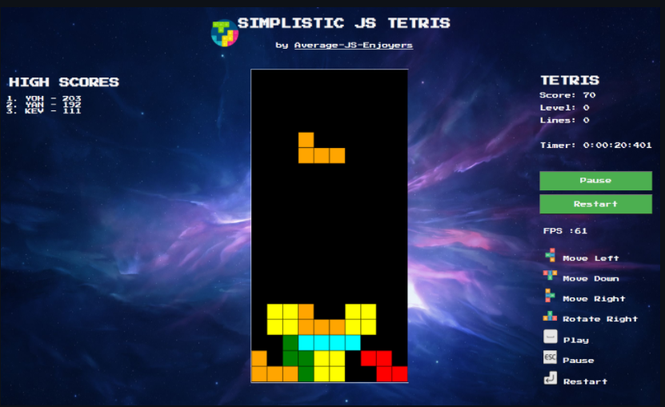
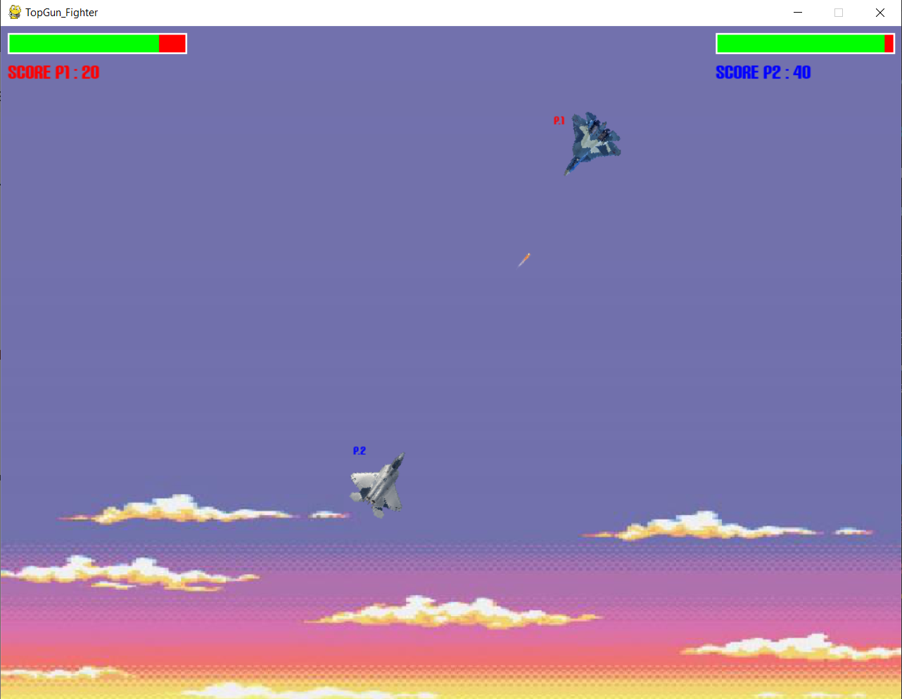

<h1>
    <a name="top" href="https://github.com/KevOneRedOne">Hello There 👋 I'm Kévin 🐺 </a>
</h1>

- I'm a `Fullstack Developer` from `France`, near to Paris .
- I'm currently doing a Master's Degree in `Advanced Web Development` at <a href="https://www.ynov.com/formations/informatique/mastere-expert-en-developpement-web">Ynov Campus</a> in Paris. In parallel, I'm working at <a href="https://www.itesoft.com/fr/">ITESOFT</a> as a project developer.
  
- I'm passionate about technologies, nature, motorsports, and I love to learn new things. 
  
- I'm working with , , , ,  and .
  
- I'm also interested about `DevOps` and `Cloud Computing`.

<h2>
    📚 My GitHub Stats
</h2>  

    
    

 

    More About Me 🐺

 

<h3>
    🔭 Current Project
</h3>

<table>
  <thead align="center">
    <tr style="border: none;">
      <td><b>🎁 Projects</b></td>
      <td><b>📋 Description</b></td>
      <td><b>📈 Status</b></td>
      <td><b>⚡ Type of Project</b></td>
    </tr>
  </thead>
  <tbody>
    <tr>
      <td><a href="https://github.com/Peel-Organisation"><b>Peel - Dating App (React-Native)</b></a></td>
      <td>Peel is an innovative photo-free dating app, inspired by Tinder in its operation but not relying on the promotion of physical appearance to bring users together.</td>
      <td>🚧 In Progres</td>
      <td>Team Project</td>
    </tr>
	  <tr>
      <td><a href="https://github.com/Peel-Organisation/Peel_API/tree/development"><b>Peel - RestFull API on EC2 (Express)</b></a></td>
      <td>Peel API is a RESTfull API in Express.js and deploy on Aws EC2, that allows users of our mobile application (PEEL) to meet people without going through their physical appearance.</td>
      <td>🚧 In Progres</td>
      <td>Team Project</td>
    </tr>
    <tr>
      <td><a href="https://github.com/KevOneRedOne/Learning_architecture_web"><b>Learning_architecture_web</b></a></td>
      <td>Master 1 web development course project : Learn web architecture through the evolution from monolithic to microservices using Go, Vue.js, PostgreSQL, Gin, Fastify, and Docker.</td>
      <td>🚧 In Progres</td>
      <td>Solo Project</td>
    </tr>
  </tbody>
</table>

[(Back to top)](#top)

<h3>
    🌱 Currently learning
</h3>

 

    
🌐 Web Development

     
    

        
        
        
        
        
        
        
        
        
        
    

    
☁️ DevOps & Cloud Computing

     
    

        
        
        
        
        
    

[(Back to top)](#top)

<h3>
    🛠️ Skills & Tools
</h3>

 

    
🌐 Web Development

     
    

        
        
        
        
        
        
        
         
        
        
        
    

    
📋 Application Development

     
    

        
        <!--  -->
        <!--  -->
        
    

    
📱 Mobile Development

     
    

        
        <!--  -->
    

    
☁️ DevOps & Cloud Computing

     
    

        
        
        
        
        
    

    
💾 Databases

     
    

        
        
        
    

    
🕓 Version Control

     
    

        
        
        
        
    

    
📚 Others Things

     
    

        
        
        
        
        
        
        
        
        
        
        
        
        
        
        
        
        
        
        
        
        
    

[(Back to top)](#top)

<h3>
    📫 How to reach me
</h3>

 

    
    
    

[(Back to top)](#top)

### ⚡ One More Thing

- If you want to play an old `Tetris Game` from your browser during your breaks, visit my very first `Javascript` game (1st year Bachelor project)  

 

    
    

 

- Or if you want to play another `Retro Game`, visit my very first game in `Python` (2nd year Bachelor project) 

     

    
    

 

[(Back to top)](#top)

 

 

This <i>README</i> file is deploy with <i>GITHUB Pages</i>! Last Update: 04/02/2024  From 🐺  

   

